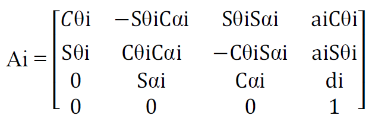
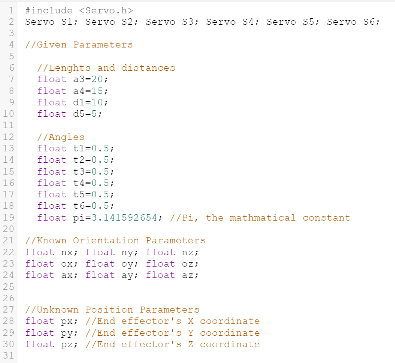
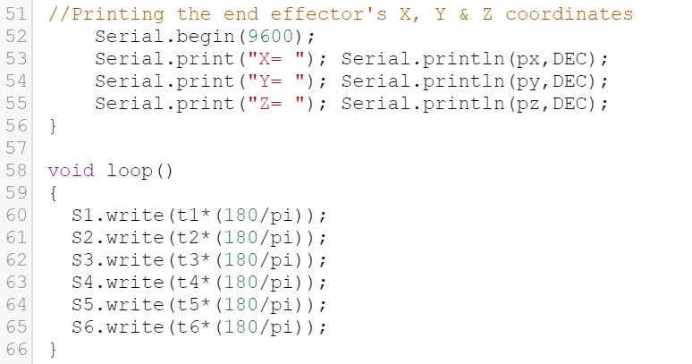
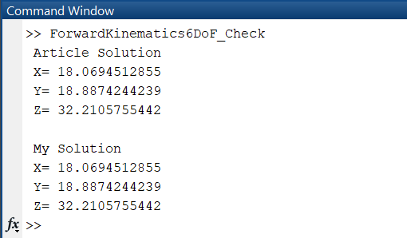

# Forward-Kinematics-for-6-DoF-Robotic-Arm

## Overview
#### Previously, in forward kinematic analysis for 3 degrees of freedom robotic arm, trigonometric functions were used to get the end effector’s position considering joints angles. Imagine if we had 6 degrees of freedom, would it be this simple to be solved this way? Of course it would’ve been so complicated. 
#### This task is about doing the forward kinematic analysis for 6 DoF robotic arm with using the Denavit-Hartenberg Convention. In order to use this D-H convention, specific parameters need to be used, and three rules must be followed.

### Denavit–Hartenberg Parameters
#### ai: The length distance from zi to zi+1 measured along zi.
#### αi: The twist angle (in radians) between zi and zi+1 measured about xi.
#### di: The offset distance from xi and xi+1 measured along zi.
#### θi: The angle (in radians) between xi and xi+1 about zi.
### Denavit–Hartenberg Rules
#### 1.	Z in the axis of rotation
#### 2.	Xi axis is perpendicular to Zi and Zi-1 and intersects Zi-1
#### 3.	Y direction is found by the right hand rule

#### This task has been accomplished following the upcoming steps, starting with the block diagram and ending with the forward kinematics code.

## Step 1: Draw the modeling block diagram following the Denavit–Hartenberg Rules

## Step 2: Find the D-H parameters stated earlier from the block diagram for one joint, and substitute them in the transformation matrix

## Step 3: Repeat the second step for the rest of the joints and multiply the transformation matrices to find the total transformation matrix

 

### Matrices Multiplication using MATLAB
syms C1 C2 C3 C4 C5 C6;
syms S1 S2 S3 S4 S5 S6;
syms a3 a4;

syms d1 d5;

%Matrices
A1=[C1 -S1 0 0
S1 C1  0 0
0  1  d1
0  0  0  1];
 
A2=[C2 0 S2  0
S2 0 -C2 0
0  1  0  0
0  0  0  1];
 
A3=[C3 -S3 0 a3*C3
S3 C3  0 a3*S3
0  0  1  0
0  0  0  1];
 
A4=[C4 -S4 0 a4*C4
S4 C4 0 a4*S4
0  0  1  0
0  0  0  1];
 
A5=[C5  0 -S5  0
S5  0  C5  0
0  -1  0  d5
0   0  0  1];
 
A6=[C6 -S6  0  0
S6 C6   0  0
0   0   1  0
0   0   0  1];
 
T=A1*A2*A3*A4*A5*A6 %Matrices are multiplied
 
%Known Rotational Paramters
nx=T(1,1);
ny=T(2,1);
nz=T(3,1);
 
ox=T(1,2);
oy=T(2,2);
oz=T(3,2);
 
ax=T(1,3);
ay=T(2,3);
az=T(3,3);
  
%End Effector's Cartesian Coordinates
px=T(1,4);
py=T(2,4);
pz=T(3,4);

## Step 4: Get the end effector’s position from the total transformation matrix

#### For getting the end effector’s coordinates from the matrix, the variables px, py, and pz are typed in the MATLAB command window to get x, y and z coordinated, respectively.

## Step 5: Arduino Code
#### This is the final step to complete this task, which is writing the code with specifying the angles and distances as constants and resulting the position as an output in the serial monitor. [1]

#### At first, the Servo library was included, and the servo motors were identified. Then the angles -in radians- and distances were specified representing the input, and the unknown parameters, the end effector’s position, represent the output.

#### After that, the servo motors were attached to the Arduino’s digital pins, and the equations used to get the end effector’s position.

#### In order to show the output, the Serial.print function was used including “DEC” function to show all decimals of each coordinate value.

#### The output is shown in the serial monitor which represents the end effector’s X, Y and Z coordinates. 

## Step 6: Checking Results
#### An article was used as a reference [2] and the results were compared using MATLAB code.

a3=20;
a4=15;
d1=10;
d5=5;
 
t1=0.5;
t2=0.5;
t3=0.5;
t4=0.5;
t5=0.5;
t6=0.5;
 
%Article’s Solution
px1 = a4*cos(t1+t2)*cos(t3)*cos(t4) - a4*cos(t1+t2)*sin(t3)*sin(t4) + sin(t1+t2)*d5 + a3*cos(t1+t2)*cos(t3);
py1 = a4*sin(t1+t2)*cos(t3)*cos(t4) - a4*sin(t1+t2)*sin(t3)*sin(t4) - cos(t1+t2)*d5 + a3*sin(t1+t2)*cos(t3);
pz1 = a4*sin(t3)*cos(t4) + a4*cos(t3)*sin(t4) + a3*sin(t3) + d1;
 

%My Solution
px2 = d5*(cos(t1)*sin(t2) + cos(t2)*sin(t1)) - cos(t3)*a3*(sin(t1)*sin(t2) - cos(t1)*cos(t2)) - cos(t3)*cos(t4)*a4*(sin(t1)*sin(t2) - cos(t1)*cos(t2)) + sin(t3)*sin(t4)*a4*(sin(t1)*sin(t2) - cos(t1)*cos(t2));

py2 = d5*(sin(t1)*sin(t2) - cos(t1)*cos(t2)) + cos(t3)*a3*(cos(t1)*sin(t2) + cos(t2)*sin(t1)) + cos(t3)*cos(t4)*a4*(cos(t1)*sin(t2) + cos(t2)*sin(t1)) – sin(t3)*sin(t4)*a4*(cos(t1)*sin(t2) + cos(t2)*sin(t1));

pz2 = d1 + sin(t3)*a3 + cos(t3)*sin(t4)*a4 + cos(t4)*sin(t3)*a4;
 
fprintf(" Article Solution \n X= %1.10f \n Y= %1.10f \n Z= %1.10f \n \n", px1, py1, pz1);
fprintf(" My Solution \n X= %1.10f \n Y= %1.10f \n Z= %1.10f \n", px2, py2, pz2);

#### As shown in the figure above, the results were identical for the forward kinematics analysis with fixed angles, lengths and distances. In order to assure that the solution is correct, an inverse kinematics must be performed and with the forward kinematics results as an input to get the angles of rotation as an output.

## References

[1] 	M. Alsaggaf, "6 DoF Robotic Arm Forward Kinematics," TinkerCAD, 28 07 2020. [Online]. Available: https://www.tinkercad.com/things/56EDMEckwu9.

[2] 	A. N. A.-A. Hanan A.R. Akkar, "Kinematics Analysis and Modeling of 6 Degree of Freedom Robotic Arm from DFROBOT on Labview," Research Gate, 07 06 2016. [Online]. Available: https://www.researchgate.net/publication/310389891_Kinematics_Analysis_and_Modeling_of_6_Degree_of_Freedom_Robotic_Arm_from_DFROBOT_on_Labview. [Accessed 13 07 2020].

[3] 	A. Sodemann, "Robotics 1 U1 (Kinematics) S3 (Rotation Matrices) P4 (6-DoF Example and Error Checking)," YouTube, 27 08 2017. [Online]. Available: https://youtu.be/KslFPohHkxA. [Accessed 24 07 2020].

[4] 	milfordrobotics, "Forward and Inverse Kinematics Part 1," YouTube, 03 08 2011. [Online]. Available: https://youtu.be/VjsuBT4Npvk. [Accessed 24 07 2020].

[5] 	milfordrobotics, "Forward and Inverse Kinematics Part 2," YouTube, 04 08 2011. [Online]. Available: https://youtu.be/3ZcYSKVDlOc. [Accessed 24 07 2020].

[6] 	"Create Symbolic Numbers, Variables, and Expressions," MathWorks, [Online]. Available: https://www.mathworks.com/help/symbolic/create-symbolic-numbers-variables-and-expressions.html. [Accessed 27 07 2020].
